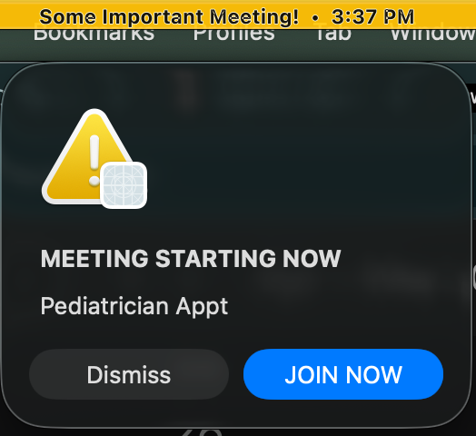
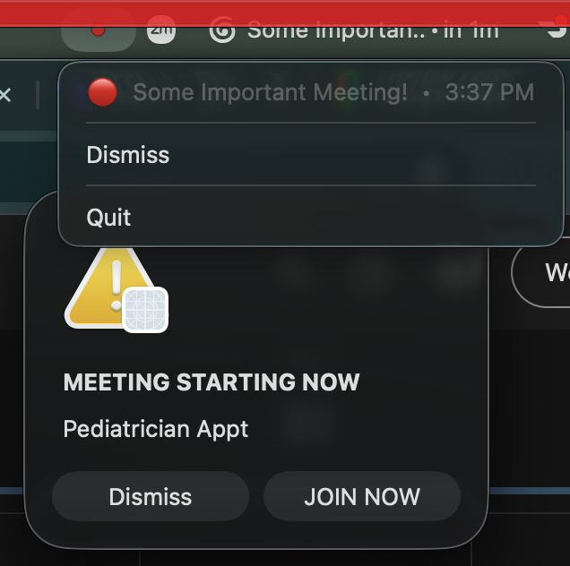

# Dont Be Late!

A macOS background daemon that makes it really hard to miss a meeting.

- **T-3 min:** A yellow border appears around every display.
- **T-1 min:** Border turns red and starts pulsing.
- **T-0:** A critical AppleScript modal steals focus. `Enter` joins the meeting.

| Yellow phase | Red alert |
| :---: | :---: |
|  |  |

Reads upcoming events from Google Calendar, extracts the Zoom/Meet URL, and overlays a click-through PyQt6 window above full-screen apps and the menu bar.

## Setup

1. Install [uv](https://docs.astral.sh/uv/).
2. Drop a Google Calendar OAuth `credentials.json` in the project root.
3. Tweak `config.yaml` if you want (poll interval, accepted-only filtering, office location).
4. Run the installer:

   ```sh
   ./install.sh
   ```

   This loads `com.ahmed.dont-be-late.plist` as a LaunchAgent — it'll start at login and restart on crash.

## Logs

```sh
tail -f /tmp/dont-be-late.err
```

## Uninstall

```sh
launchctl unload ~/Library/LaunchAgents/com.ahmed.dont-be-late.plist
rm ~/Library/LaunchAgents/com.ahmed.dont-be-late.plist
```

See `design.md` for the full design rationale.
